[Jacobs Tech Tavern](https://blog.jacobstechtavern.com/p/migrating-combine-to-asyncalgorithms)
[AsyncAlgorithms](https://github.com/apple/swift-async-algorithms)
[AsyncExtensions](https://github.com/sideeffect-io/AsyncExtensions)
[Before / After](https://github.com/jacobsapps/Combine2AsyncAlgos/tree/main/After/Combine2AsyncAlgos)

# Repository Interface Changes
The repository interface using Combine:
```swift
import Combine 

protocol ContentRepo {
    var userSubject: CurrentValueSubject<User?, Error> { get }
    var chatNotificationsSubject: CurrentValueSubject<[Notification], Never> { get }
    var friendNotificationsSubject: CurrentValueSubject<[Notification], Never> { get }
    var downloadSubject: PassthroughSubject<Double, Never> { get }
    func loadUser()
    func streamChatNotifications()
    func streamFriendNotifications()
    func performDownload()
}
```

A Swift concurrency interface:
```swift
import AsyncAlgorithms 

protocol ContentRepo {
    var userChannel: AsyncThrowingChannel<User?, Error> { get }
    var chatNotificationsSequence: AsyncPublisher<AnyPublisher<[Notification], Never>> { get }
    var friendNotificationsSequence: AsyncPublisher<AnyPublisher<[Notification], Never>> { get }
    func loadUser()
    func streamChatNotifications()
    func streamFriendNotifications()
    func performDownload() -> AsyncStream<Double>
}
```
We are 
- importing `AsyncAlgorithms` to grant access to `_throttle` and `combineLatest` functions
- Using a buffering `AsyncThrowingChannel` for access to `User` objects.  The channel is used to provide single user events
- Using a `AsyncPublisher` type to provide access to a Combine subects' values.
- Using a `AsyncStream` to access download progress events from the `performDownload()` function.

# Setup Logic
we’ve also converted the setup code in the view model; from this classic Combine setup: 
```swift
private func configureSubscriptions() {
    subscribeToUser()
    subscribeToNotifications()
    subscribeToDownloadTask()
}

private func loadData() {
    repo.loadUser()
    repo.streamChatNotifications()
    repo.streamFriendNotifications()
    repo.performDownload()
}
```
To use Swift concurrency:
```swift
private func configureSubscriptions() {
    Task { await handleUserValues() }
    Task { await performDownload() }
    Task { await streamNotificationCount() }
}

private func loadData() {
    repo.loadUser()
    repo.streamChatNotifications()
    repo.streamFriendNotifications()
}
```


# Using `AsyncStream` instead of Combine

Get the values from a Combine subject
```swift
private var chatNotificationsSubject = CurrentValueSubject<[Notification], Never>([])

var chatNotificationsSequence: AsyncPublisher<AnyPublisher<[Notification], Never>> {
    chatNotificationsSubject.eraseToAnyPublisher().values
}
```

To combine two streams, use [AsyncAlgorithms](https://www.google.com/url?sa=t&source=web&rct=j&opi=89978449&url=https://github.com/apple/swift-async-algorithms&ved=2ahUKEwjU-_a8p9iKAxVjIDQIHTvrECsQFnoECAsQAQ&usg=AOvVaw2ofM276M_LoN17atMqHc-x)
```swift
private func streamNotificationCount() async {
    for await notificationsCount in combineLatest(
        repo.chatNotificationsSequence,
        repo.friendNotificationsSequence
    ) { ... }
}
```

From SwiftUI view:
```swift
@MainActor
private func streamNotificationCount() async {
    for await notificationsCount in combineLatest(
        repo.chatNotificationsSequence,
        repo.friendNotificationsSequence
    ).map({
        $0.0.count + $0.1.count
    }) {
        self.notificationCount = notificationsCount
    }
}
```

>Since we’re assigning a property on our observable view model, we put this method on the `@MainActor` to ensure thread safety. 

This single `@MainActor` attribute neatly replaces the `.receive(on: RunLoop.main)` operation. The `for-await-in` syntax serves as a suspension point between each iteration of the stream — the waiting itself is happening off the main thread.

We can use an extension method on `AnyPublisher` to build an `async` version of the Combine publisher:

```swift
enum AsyncError: Error {
    case finishedWithoutValue
}

extension AnyPublisher {
    func async() async throws -> Output {
        try await withCheckedThrowingContinuation { continuation in
            var cancellable: AnyCancellable?
            var finishedWithoutValue = true
            cancellable = first()
                .sink { result in
                    switch result {
                    case .finished:
                        if finishedWithoutValue {
                            continuation.resume(throwing: AsyncError.finishedWithoutValue)
                        }
                    case let .failure(error):
                        continuation.resume(throwing: error)
                    }
                    cancellable?.cancel()
                } receiveValue: { value in
                    finishedWithoutValue = false
                    continuation.resume(with: .success(value))
                }
        }
    }
}
```
This extension function does the following:
1. Sinks the first value in the stream
    1. If the result is `.finished` and if `finishedWithoutValue` is true, pass the error to the continuation
    2. If the result is an error, pass the error to the continuation.
    3. If a value was received
        1. set `finishedWithoutValue` to false
        2. call `continuation.resume()` with a `.success(value)`

kjfdkasjfjlkasdjfjsadjj
kljasldkfj
lsdkjflj

## Converting closure based handling to use `AsyncStream`s
If we currently have
```swift
var downloadSubject = PassthroughSubject<Double, Never>()
private let downloadAPI = DownloadAPI()

func performDownload() {
    Task {
        await downloadAPI.startDownload { [weak self] percentage in
            self?.downloadSubject.send(percentage)
        }
    }
}
```
We are passing in a closure to `downloadAPI.startDownload()` which takes in a percentage sourced from the `startDownload()` function and sends the percentage to the `downloadSubject`.  

We can convert this to use an `AsyncStream` instead:
```swift
func performDownload() async -> AsyncStream<Double> {
    AsyncStream { continuation in
        Task {
            await downloadAPI.startDownload { percentage in
                continuation.yield(percentage)
            }
            continuation.finish()
        }
    }
}
```
`AsyncStream` objects are created by passing in a closure with a single `continuation` input parameter.  The `continuation` is the bridge between the event source and the stream, call `continuation.yield(...)` to send values to the stream, or `continuation.finish()` to complete the stream.

The `startDownload()` function takes a closure that captures the `continuation` set when creating the `AsyncStream`.  To use `AsyncStream` you need to have the event generator object access the `continuation` to send events to the stream.

> Note that the closure is not passed as `[weak self]`.  I wonder why not?  The original version did use `[weak self]`

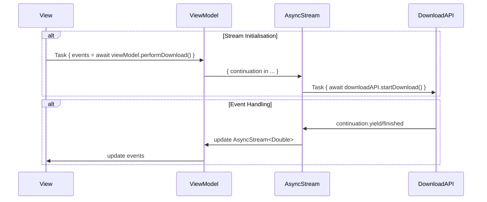

Here, we are initializing the stream as well as starting the download immediately.  This is represented by the two `alt` blocks `Stream Initialisation` and `Event Handling`.  The `AsyncViewModel` and `DownloadAPI` class might look like this:

```swift
class ViewModel {
    let downloadAPI: DownloadAPI
    
    init(downloadAPI: DownloadAPI) {
        self.downloadAPI = downloadAPI
    }
    
    func performDownload() async -> AsyncStream<Double> {
        AsyncStream { continuation in
            Task {
                await downloadAPI.startDownload { percentage in
                    continuation.yield(percentage)
                }
                continuation.finish()
            }
        }
    }
}

class DownloadAPI {
    func startDownload(completion: @escaping (Double) -> Void) async {
        for i in 1...5 {
            do {
                try await Task.sleep(nanoseconds: 10_000_000)
                completion(Double(i * 20))
            } catch {
                completion(0)
            }
        }
    }
}
```

and the corresponding SwiftUI view:
```swift
struct AsyncView: View {
    @State var generator = AsyncStreamGenerator()
    @State private var currentValue = 0
    @State var viewModel = AsyncViewModel(downloadAPI: DownloadAPI())
    
    var body: some View {
        VStack {
            Button("Start") {
                Task {
                    // start the stream
                    let events = await generator.downloadEvents()
                    print("Events")
                    
                    for await event in events {
                        print(event)
                    }
                }
            }
            
            Button("Stop") {
                // end the stream
            }
            
            Button("AsyncViewModel") {
                Task {
                    let events = await viewModel.performDownload()
                    
                    for await event in events {
                        print(event)
                    }
                }
            }
        }
    }
}
```

```swift
func trackDownload() -> AsyncStream<Double> {
    AsyncStream<Double> { continuation in 
        let delegate = DownloadProgressDelegate(continuation: continuation)
        URLSession.shared.delegate = progressDelegate
    }
}

final class DownloadProgressDelegate: NSObject, URLSessionDownloadDelegate {
    // ...
    let continuation: AsyncStream<Double>.Continuation

    func urlSession(_ session: URLSession,
                    downloadTask: URLSessionDownloadTask,
                    didWriteData bytesWritten: Int64,
                    totalBytesWritten: Int64,
                    totalBytesExpectedToWrite: Int64) {
        let progress = Double(totalBytesWritten) / Double(totalBytesExpectedToWrite)
        continuation.yield(progress * 100)
    }

}
```
In this example, we are initializing the `DownloadProgressDelegate` object with a `continuation` when the `AsyncStream` is created.   Later, when the `DownloadProgressDelegate.urlSession(...)` function is called, the `continuation` is used to send values to the `AsyncStream` by calls to the `yield()` function on the continuation.
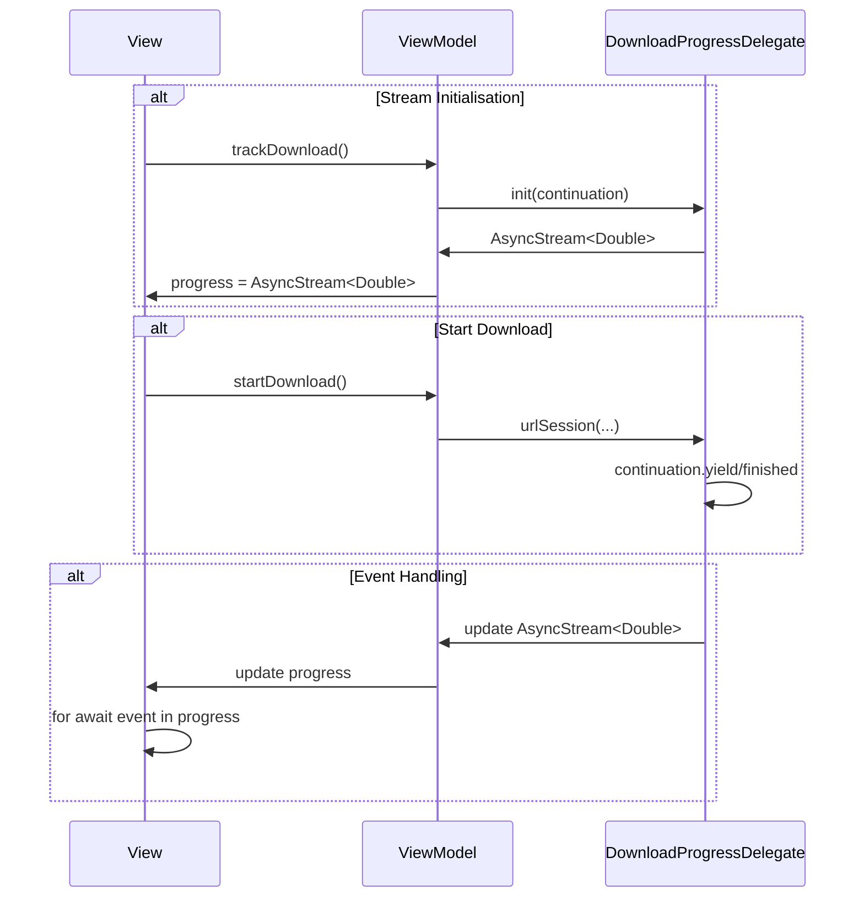
Here, we are initializing the stream, then starting the download from a request from the View, then handling the event in the View.

## Updating the UI
The original Combine code to update the view:
```swift
private func subscribeToDownloadTask() {
    repo.downloadSubject
        .throttle(for: .seconds(0.05), scheduler: RunLoop.main, latest: true)
        .receive(on: RunLoop.main)
        .assign(to: \.downloadPercentage, on: self)
        .store(in: &cancellables)
}
```
Here we specifying the scheduler to be `RunLoop.main` to ensure that updates to the view are executed on the main thread.  A corresponding `AsyncStream` implementation might look like this:
```swift
@MainActor
private func performDownload() async {
    for await percentage in repo
        .performDownload()
        ._throttle(for: .seconds(0.05), latest: true) {
            self.downloadPercentage = percentage
        }
}
```

- The `@MainActor` attribute indicates that this function is constrained to the main actor, which means that it will run on the main thread
- The `for await in` loop is used to access data from the `repo` stream.  This is a standard way of accessing the elements of an `AsyncStream` object.

## Using `AsyncChannel` vs. `CurrentValueSubject`

We can call an API and send values returned from the API to a `CurrentValueSubject`
```swift
var userSubject = CurrentValueSubject<User?, Error>(nil)
private let userAPI = UserAPI()

func loadUser() {
    Task {
        do {
            let user = try await userAPI.getUser()
            userSubject.send(user)
        } catch {
            userSubject.send(completion: .failure(error))
        }
    }
}
```
We’re fetching data from UserAPI and sending the user data — or an error — to a CurrentValueSubject. This caches the latest value, making it easy to share the data across your app without performing lots of additional networking.  

We can use an `AsyncChannel` instead of a `CurrentValueSubject`.  `AsyncChannel` is a type heavily inspired by Combine subjects. It’s a special type of `AsyncSequence` which applies back pressure — this means [it’ll buffer values](https://github.com/apple/swift-async-algorithms/blob/main/Sources/AsyncAlgorithms/AsyncAlgorithms.docc/Guides/Channel.md). It waits for a value to be consumed downstream before calling the `next()` function on its iterator.

We begin by modifying the userSubject on our repository from a CurrentValueSubject to an AsyncThrowingChannel.
```swift
var userChannel = AsyncThrowingChannel<User, Error>()
```

We can do a straightforward conversion...
```swift
func loadUser() {
    Task {
        do {
            let user = try await userAPI.getUser()
            await userChannel.send(user)
        } catch {
            userChannel.fail(error)
        }
    }
}
```

## Updating the view
The original Combine version...
```swift
private func subscribeToUser() {
    repo.userSubject
        .compactMap { $0 }
        .receive(on: RunLoop.main)
        .sink(receiveCompletion: { completion in
            if case .failure(let error) = completion {
                print(error)
            }
        }, receiveValue: { [weak self] user in
            self?.user = user
        })
        .store(in: &cancellables)
}
```

We can come up with a version that uses `AsyncChannel`
```swift
@MainActor
private func handleUserValues() async {
    do {
        for try await user in repo.userChannel.compacted() {
            self.user = user
        }
                
    } catch {
        print(error)
    }
}
```

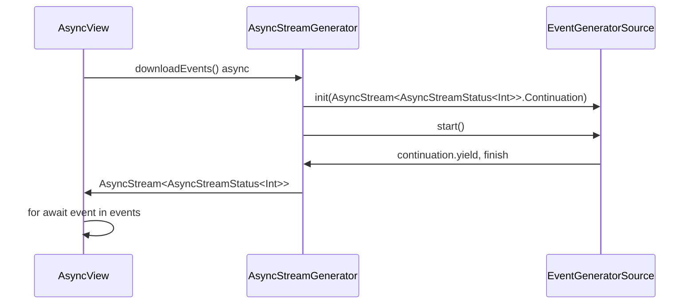
# Building an infinite stream
Given the following code:
```swift
class InfiniteStream {
    func subscribe() async -> AsyncStream<Int> {
        AsyncStream { continuation in
            Task {
                for _ in 1...10 {
                    continuation.yield(Int.random(in: 0..<Int.max))
                }
            }
        }
    }
}

struct InfiniteStreamView: View {
    @State var viewModel = InfiniteStream()
    
    var body: some View {
        Button("Start Infinite Stream") {
            Task {
                let events = await viewModel.subscribe()
                for await event in events {
                    print(event)
                }
            }
        }
    }
}
```
The 10 random numbers are all generated and stored within the stream before being
processed later by the `for await event...` line.  I would like to emit events and 
display them in the view as each event is generated.

Contrast that with this code:
```swift
class InfiniteStream {
    func subscribe() async -> AsyncStream<Int> {
        AsyncStream {
            try? await Task.sleep(nanoseconds: 1_000_000_000)
            return Int.random(in: 1...10)
        }
    }
}

struct InfiniteStreamView: View {
    @State var viewModel = InfiniteStream()
    
    var body: some View {
        Button("Start Infinite Stream") {
            Task {
                let events = await viewModel.subscribe()
                for await event in events {
                    print(event)
                }
            }
        }
    }
}
```
The main difference is within the `InfiniteStream.subscribe()` function,

```swift
    AsyncStream { continuation in
        Task {
            for _ in 1...10 {
                continuation.yield(Int.random(in: 0..<Int.max))
            }
        }
    }
```
vs. new:
```swift
    AsyncStream {
        try? await Task.sleep(nanoseconds: 1_000_000_000)
        return Int.random(in: 1...10)
    }
```
The difference is that in the original version, the elements are loaded into the stream by
calling `continuation.yield()` 10 times.  The new version doesn't use continuation, it sleeps and
returns a random integer from 1 to 10.  What if we used the version below...

```swift
    AsyncStream { continuation in
        try? await Task.sleep(nanoseconds: 1_000_000_000)
        continuation.yield(Int.random(in: 0..<Int.max))
        }
    }
```

# SwiftUI Integration
When using SwiftUI views and `AsyncStream` objects, we can use the `.task` view modifier to initiate event generation from our generator:

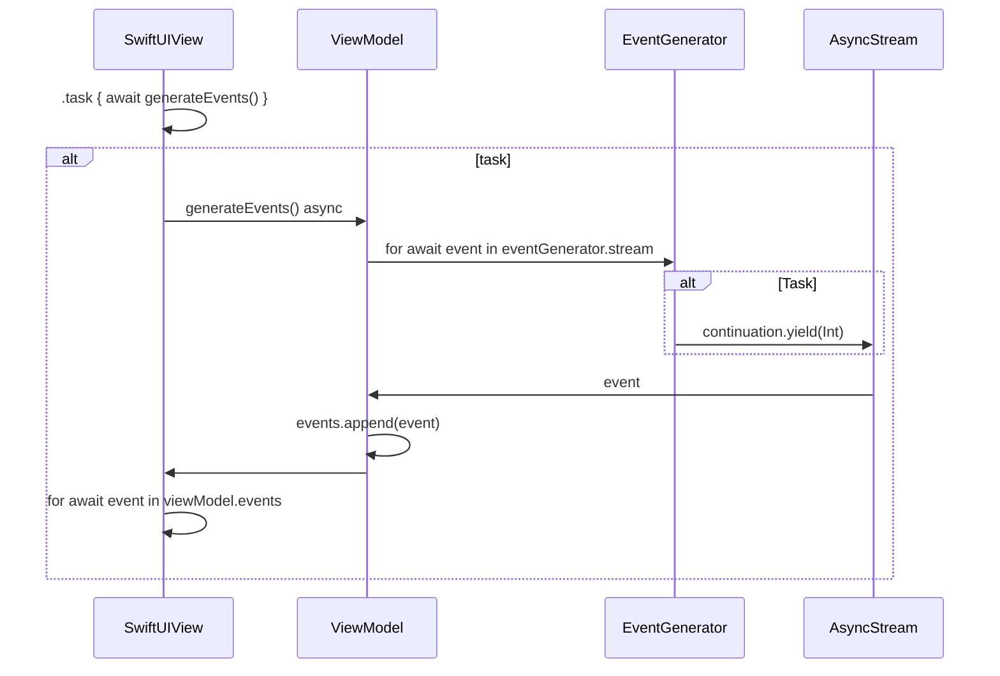

The sequence diagram above corresponds to the following class diagram

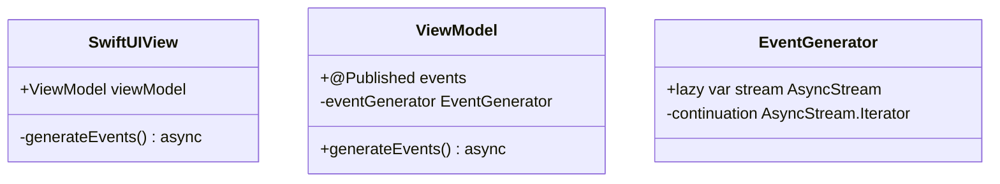

You could also merge the `ViewModel` and `EventGenerator` into a single object that the `SwiftUI` view would use:
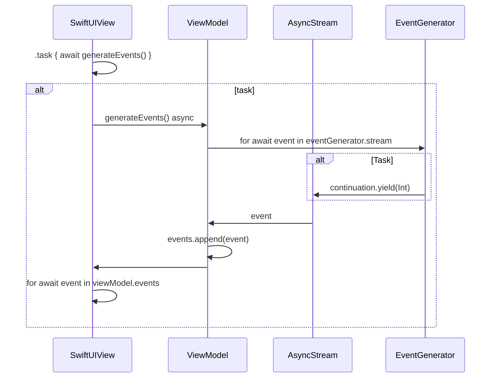


# Stopwatch App
This app provides the ability to provide stop watch functionality,
specifically:
1. Start the stop watch
2. Display the time in the UI
3. Stop the stop watch

## Stopwatch UI

## Design
### Participants
The following objects participate with each other in the app:
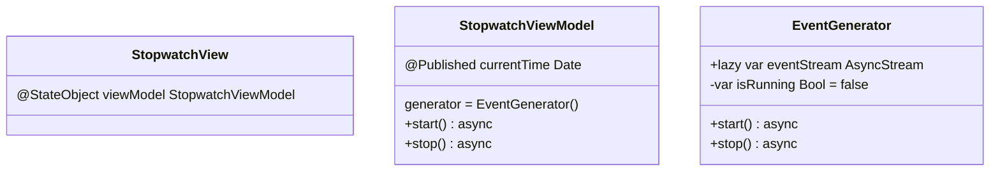

### Events
There are only a few events that are returned from the `EventGenerator`:
- the current time
- a cancel event

### Event Flow
The `StopwatchView`, in response to the start button tap event will make an async call
to the `StopwatchViewModel.start()` asynchronous function.
```swift
struct StopwatchView : View {
    @StateObject var viewModel = StopwatchViewModel()
    
    var body: some View {
        VStack {
            Button("Start Stopwatch") {
                Task {
                    await viewModel.start()
                }
            }
            
            Button("Stop Stopwatch") {
                Task {
                    await viewModel.stop()
                }
            }
            
            Divider()
            Label("Current time: \(viewModel.currentTime)", systemImage: "timer")
        }
    }
}
```
A few notes:
> We use an `@StateObject` property wrapper to observe changes to the `StopwatchViewModel`


> We wrap the calls to the view model within a `Task` block since we need to call the view model functions
from an async context.

The view model then `await`s on the `generator.eventStream`, and when an event is published 
on the `eventStream`, set the `currentTime` to the event.
```swift
@MainActor
class StopwatchViewModel: ObservableObject {
    @Published var currentTime: Date = Date()
    private let generator = EventGenerator()
    
    func start() async {
        for await event in generator.eventStream {
            currentTime = event
        }
    }
    
    func stop() async {
        
    }
}
```
> We annotate the class with the `@MainActor` attribute to ensure that all methods on `StopwatchViewModel` are executed on the main thread.

The event generator just emits the current date into the stream
```swift
class EventGenerator {
    lazy var eventStream: AsyncStream<Date> = {
        AsyncStream { continuation in
            continuation.yield(Date.now)
        }
    }()
}
```
> I'm using a `lazy` variable to represent the stream.  The `eventStream` variable will be set to the return sent from the closure.  The closure returns an `AsyncStream<Data>` object.


> Elements are sent to the stream by calling `continuation.yield(DateTime.Now)`

When the app is run, we can start the stopwatch and see the new date, but stopping the stopwatch doesn't do anything, and neither does tapping the start button.  Basically we have a stopwatch that can only give us the latest date, and only once.  We'd like to get updated times after we tap the start button.  And once we tap the stop button, no subsequent events are received from the stopwatch.

Let's add a property to `EventGenerator` that tracks the running state of the generator and add `start()` and `stop()` functions to set the `isRunning` property.

```swift
class EventGenerator {
    private var isRunning: Bool = false
    
    lazy var eventStream: AsyncStream<Date> = {
        AsyncStream { continuation in
            while(isRunning) {
                continuation.yield(Date.now)
            }
        }
    }()
    
    func start() async {
        isRunning = true
    }
    
    func stop() async {
        isRunning = false
    }
}
```
We need to update the view model to call the `start()` and `stop()` functions.
```swift
@MainActor
class StopwatchViewModel: ObservableObject {
    @Published var currentTime: Date = Date()
    private let generator = EventGenerator()
    
    func start() async {
        await generator.start()
        
        for await event in generator.eventStream {
            currentTime = event
        }
    }
    
    func stop() async {
        await generator.stop()
    }
}
```
Theoretically, this should do the trick but the events are just getting generated too fast for the UI to keep up, so let's introduce a delay between events in the `EventGenerator` object:

```swift
class EventGenerator {
    private var isRunning: Bool = false
    
    lazy var eventStream: AsyncStream<Date> = {
        AsyncStream { continuation in
            Task {
                while(isRunning) {
                    do {
                        try await Task.sleep(nanoseconds: 5_000_000)
                    }
                    catch{
                        print(error)
                    }
                    
                    continuation.yield(Date.now)
                }
            }
        }
    }()
    
    func start() async {
        isRunning = true
    }
    
    func stop() async {
        isRunning = false
    }
}
```
I've introduced a delay by calling `Task.sleep()` sync the call throws it needs be wrapped in a `do-catch` block.  This block also needs to be wrapped in a `Task` block since we are calling `await Task.sleep(...)`, the `Task` provides an async context within the synchronous property `eventStream`.
 

### More
We can make the view/viewmodel a little better by moving the `Task` block into the view model:

```swift
struct EventGeneratorView: View {
    @StateObject var viewModel = EventGeneratorViewModel()
    
    var body: some View {
        VStack {
            Button("Start", systemImage: "timer") {
                viewModel.getUser()
            }
            
            Label(viewModel.currentUser, systemImage: "person.fill")
        }
    }
}

@MainActor
class EventGeneratorViewModel : ObservableObject {
    @Published var currentUser: String = ""
    let generator: Generator<User>?
    let service: UserService?
    
    init() {
        self.service = UserService()
        self.generator = Generator<User>()
        let workItem = WorkItem { return self.service?.getUsers() }
        self.generator?.workItem = workItem
    }
    
    func getUser() {
        Task {
            await getUser()
        }
    }
    
    private func getUser() async {
        currentUser = "No User"
        var i:Int = 1
        
        guard let gen = generator else { return }
        
        for await user in gen.getStream() {
            currentUser = "User #\(String(i)): \(user.details.firstName)"
            i += 1
        }
        
        currentUser = "Terminated"
    }
}

class Generator<T> {
    var workItem: WorkItem<T>? = nil
    
    init() {}
    
    init(workItem: WorkItem<T>) {
        self.workItem = workItem
    }
    
    func getStream() -> AsyncStream<T> {
        AsyncStream<T> { continuation in
            Task {
                guard let wi = workItem else {
                    continuation.finish()
                    return
                }
                
                let users:[T] = wi.execute() ?? [] // returns [User]
                var i = 1
                
                for user in users {
                    try await Task.sleep(nanoseconds: UInt64(i * 2_000_000_000))
                    continuation.yield(user)   // User
                    i += 1
                }
                
                try await Task.sleep(nanoseconds: 1 * 5_000_000_000)
                continuation.finish()
            }
        }
    }
}
```


## Services
### User Service
Provides the following support:
1. Get all or a subset of users
2. Get details for a specific user

```swift
class UserService {
    func getUsers() -> [User] {
        return [
            buildUser(first: "Phil", last: "Kirby"),
            buildUser(first: "Quintella", last: "Kirby"),
            buildUser(first: "Kimberly", last: "Kirby")
        ]
    }
    
    private func buildUser(first: String, last: String) -> User {
        return User(first: first, last: last, dob: Date.now)
    }
}
```

The function `getUsers()` returns an array of `User` objects.  This function is _not_ async.

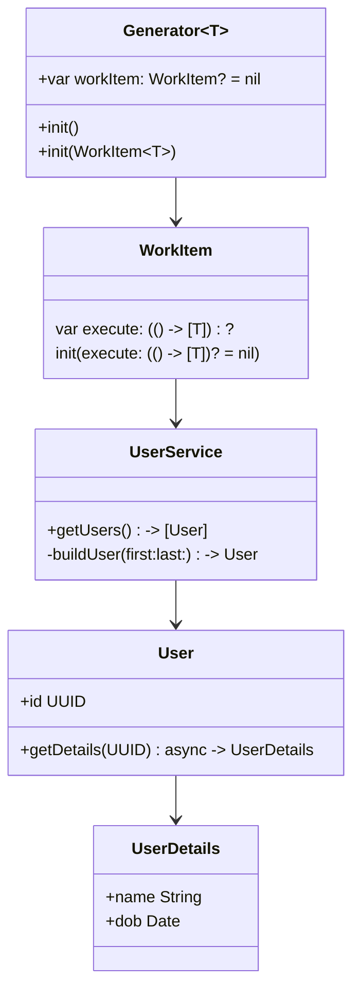
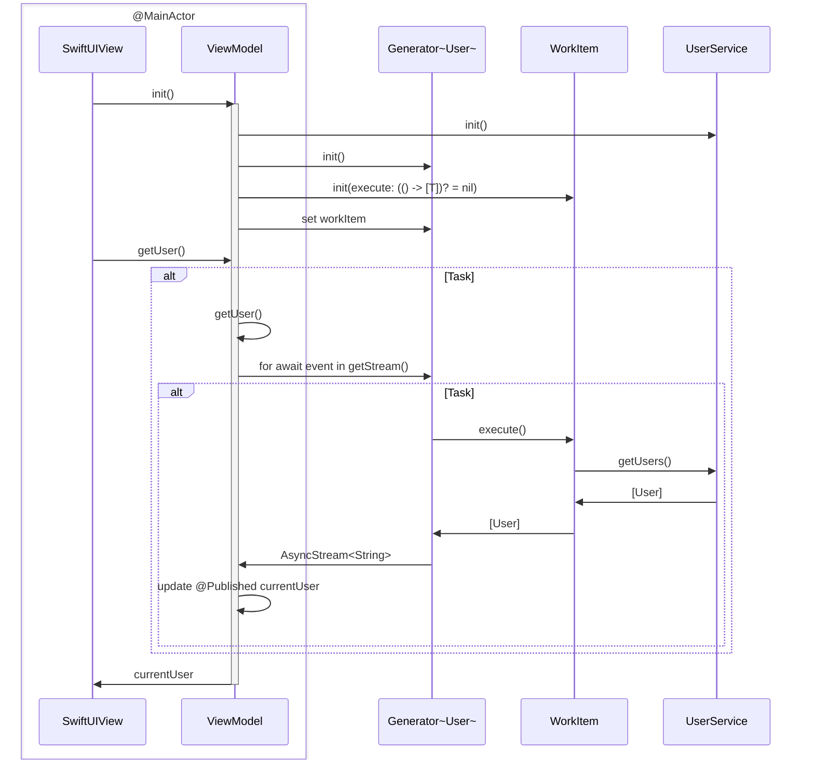

The reference diagram:
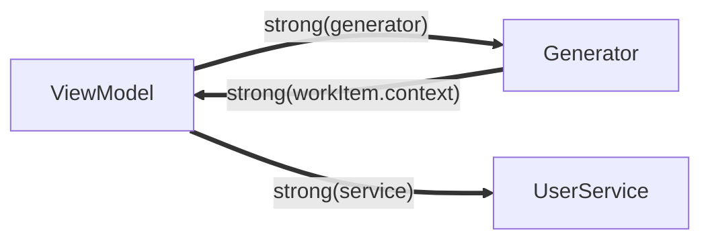

Using the debug memory graph we get the following:

Here we can see that the `EventGeneratorViewModel` has a strong reference to `AsynchronousProgramming.Generator<AsynchronousProgramming.User>` via the `generator` property of the view model.  The `AsynchronousProgramming.Generator<AsynchronousProgramming.User>` has a strong reference to the `EventGeneratorviewModel` via the `workItem` field of the generator.  We have a reference cycle.  This line creates the cycle:

```swift
let workItem = WorkItem { return self.service?.getUsers() }
```

If we update this to be:
```swift
self.generator?.workItem = WorkItem<User> { [weak self] in
    guard let self else { return [] }
    return self.service?.getUsers() ?? []
}
```


The `AsynchronousProgramming.Generator<AsynchronousProgramming.User>` now has a strong reference to `AsynchronousProgramming.WorkItem<AsynchronousProgramming.User>` and it no longer references `EventGeneratorViewModel`.

The reference diagram:
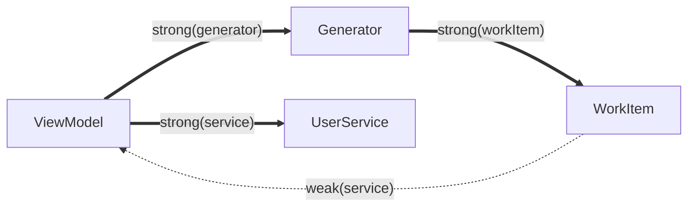
Using `[weak self]` resolves the retain cycle.

```swift
@MainActor
class EventGeneratorViewModel : ObservableObject {
    @Published var currentUser: String = ""
    let generator: Generator<User>?
    let service: UserService?
    
    init() {
        self.service = UserService()
        self.generator = Generator<User>()
        self.generator?.workItem = WorkItem<User> { [weak self] in
            guard let self else { return [] }
            return self.service?.getUsers() ?? []
        }
    }
    
    func getUser() {
        Task {
            await getUser()
        }
    }
    
    private func getUser() async {
        currentUser = "No User"
        var i:Int = 1
        
        guard let gen = generator else { return }
        
        for await user in gen.getStream() {
            currentUser = "User #\(String(i)): \(user.details.firstName)"
            i += 1
        }
        
        currentUser = "Terminated"
    }
}

class Generator<T> {
    var workItem: WorkItem<T>? = nil
    
    init() {}
    
    init(workItem: WorkItem<T>) {
        self.workItem = workItem
    }
    
    func getStream() -> AsyncStream<T> {
        AsyncStream<T> { continuation in
            Task {
                guard let wi = workItem else {
                    continuation.finish()
                    return
                }
                
                guard let exec = wi.execute else {
                    continuation.finish()
                    return
                }
                
                let users:[T] = exec() // returns [User]
                var i = 1
                
                for user in users {
                    try await Task.sleep(nanoseconds: UInt64(i * 2_000_000_000))
                    continuation.yield(user)   // User
                    i += 1
                }
                
                try await Task.sleep(nanoseconds: 1 * 5_000_000_000)
                continuation.finish()
            }
        }
    }
}

class WorkItem<T> {
    var execute: (() -> [T])?
    
    init(execute: (() -> [T])? = nil) {
        self.execute = execute
    }
}
```

## Task Groups
Task groups allow you to run a batch of Tasks in parallel, add their results (if any) to the group, and allow an object to iterate over the results _once all requests have completed_.

> Items cannot be read from a group until _all_ tasks have completed.  Results from all tasks are available once all tasks have completed and their results have been added to the group.

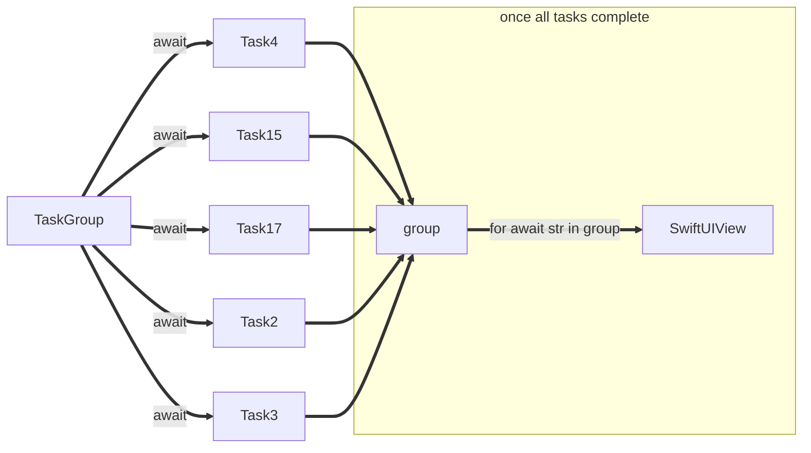

The following describes a view displaying tasks run in parallel.  Each task doesn't return anything.

```swift
struct TaskGroupView: View {
    @State var title: String = "Use a task group to start tasks in parallel"
    @State var results: [String] = []
    let ids: [Int] = [4, 15, 17, 2, 3]
    
    var body: some View {
        Button(title) {
            print(title)
            Task {
                await test()
            }
        }
        
        List(ids, id: \.self) { initial in
            Text(String(initial))
        }
        
        List(results, id: \.self) { result in
            Text(result)
        }
    }
    
    func test() async {
        return await withTaskGroup(of: Void.self) { group in
            let ids: [Int] = [4, 15, 17, 2, 3]
            
            // adding tasks to the group
            for id in ids {
                group.addTask {
                    return await self.runTask(id: id)
                }
            }
        }
    }
    
    func runTask(id: Int) async {
        Task {
            print("running \(id)")
            
            // Simulate a network call
            try await Task.sleep(nanoseconds: UInt64(id * 1_000_000_000))
            print("Task \(id) ended.")
        }
    }
}
```
This code adds a number of tasks, represented by `runTask(id:)` to be run in a group concurrently.

The following describes a view displaying tasks run in parallel.  Each task doesn't return anything.

```swift
struct d: View {
    @State var title: String = "Use a task group to start tasks in parallel"
    @State var results: [String] = []
    let ids: [Int] = [4, 15, 17, 2, 3]
    @State var currentTime: Date = Date.now
    
    var body: some View {
        Button(title) {
            print(title)
            Task {
                results = await test(ids: ids)
            }
        }
        
        List(ids, id: \.self) { initial in
            Text(String(initial))
        }
        
        Text(Date.now.description)
        
        List(results, id: \.self) { result in
            Text(result)
        }
        
        Text(Date.now.description)
    }
    
    func test(ids: [Int]) async -> [String] {
        return await withTaskGroup(of: String.self) { group in
            var results = [String]()
            
            // adding tasks to the group
            for id in ids {
                group.addTask {
                    print("running \(id)")
                    return await self.runTask(id: id)
                }
            }
            
            // await until all tasks complete
            for await str in group {
                results.append(str)
            }
            
            return results
        }
    }
    
    func runTask(id: Int) async -> String {
        do {
            // Simulate a network call
            try await Task.sleep(nanoseconds: UInt64(id * 1_000_000_000))
            return "Task \(id) ended. \(Date.now)"
        } catch {
            return "Error: \(error.localizedDescription)"
        }
    }
}
```
This code adds a number of tasks, represented by `runTask(id: Int) async -> String` to be run in a group concurrently.  Each task returns a String.

