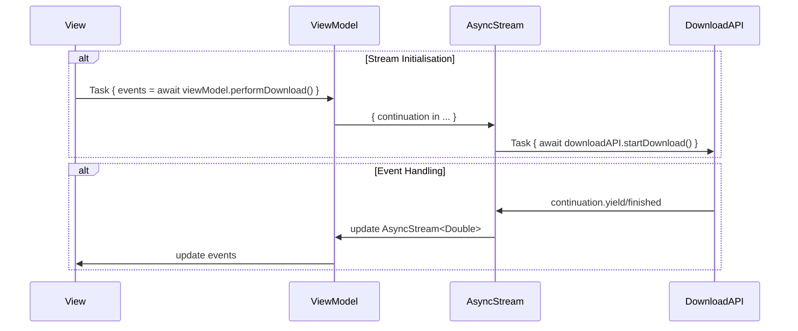
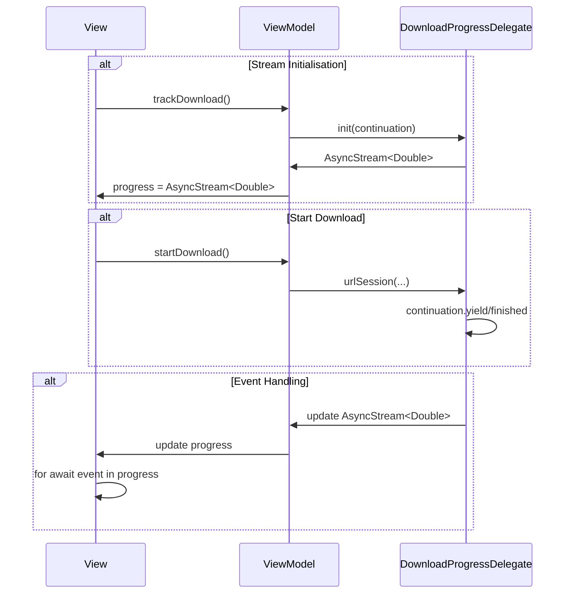
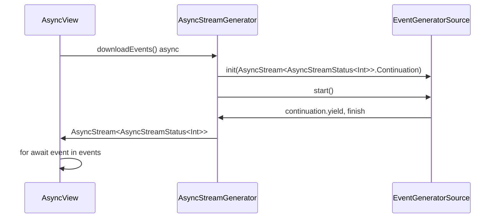

[Jacobs Tech Tavern](https://blog.jacobstechtavern.com/p/migrating-combine-to-asyncalgorithms)
[AsyncAlgorithms](https://github.com/apple/swift-async-algorithms)
[AsyncExtensions](https://github.com/sideeffect-io/AsyncExtensions)
[Before / After](https://github.com/jacobsapps/Combine2AsyncAlgos/tree/main/After/Combine2AsyncAlgos)

# Repository Interface Changes
The repository interface using Combine:
```swift
import Combine 

protocol ContentRepo {
    var userSubject: CurrentValueSubject<User?, Error> { get }
    var chatNotificationsSubject: CurrentValueSubject<[Notification], Never> { get }
    var friendNotificationsSubject: CurrentValueSubject<[Notification], Never> { get }
    var downloadSubject: PassthroughSubject<Double, Never> { get }
    func loadUser()
    func streamChatNotifications()
    func streamFriendNotifications()
    func performDownload()
}
```

A Swift concurrency interface:
```swift
import AsyncAlgorithms 

protocol ContentRepo {
    var userChannel: AsyncThrowingChannel<User?, Error> { get }
    var chatNotificationsSequence: AsyncPublisher<AnyPublisher<[Notification], Never>> { get }
    var friendNotificationsSequence: AsyncPublisher<AnyPublisher<[Notification], Never>> { get }
    func loadUser()
    func streamChatNotifications()
    func streamFriendNotifications()
    func performDownload() -> AsyncStream<Double>
}
```
We are 
- importing `AsyncAlgorithms` to grant access to `_throttle` and `combineLatest` functions
- Using a buffering `AsyncThrowingChannel` for access to `User` objects.  The channel is used to provide single user events
- Using a `AsyncPublisher` type to provide access to a Combine subects' values.
- Using a `AsyncStream` to access download progress events from the `performDownload()` function.

# Setup Logic
we’ve also converted the setup code in the view model; from this classic Combine setup: 
```swift
private func configureSubscriptions() {
    subscribeToUser()
    subscribeToNotifications()
    subscribeToDownloadTask()
}

private func loadData() {
    repo.loadUser()
    repo.streamChatNotifications()
    repo.streamFriendNotifications()
    repo.performDownload()
}
```
To use Swift concurrency:
```swift
private func configureSubscriptions() {
    Task { await handleUserValues() }
    Task { await performDownload() }
    Task { await streamNotificationCount() }
}

private func loadData() {
    repo.loadUser()
    repo.streamChatNotifications()
    repo.streamFriendNotifications()
}
```


# Using `AsyncStream` instead of Combine

Get the values from a Combine subject
```swift
private var chatNotificationsSubject = CurrentValueSubject<[Notification], Never>([])

var chatNotificationsSequence: AsyncPublisher<AnyPublisher<[Notification], Never>> {
    chatNotificationsSubject.eraseToAnyPublisher().values
}
```

To combine two streams, use [AsyncAlgorithms](https://www.google.com/url?sa=t&source=web&rct=j&opi=89978449&url=https://github.com/apple/swift-async-algorithms&ved=2ahUKEwjU-_a8p9iKAxVjIDQIHTvrECsQFnoECAsQAQ&usg=AOvVaw2ofM276M_LoN17atMqHc-x)
```swift
private func streamNotificationCount() async {
    for await notificationsCount in combineLatest(
        repo.chatNotificationsSequence,
        repo.friendNotificationsSequence
    ) { ... }
}
```

From SwiftUI view:
```swift
@MainActor
private func streamNotificationCount() async {
    for await notificationsCount in combineLatest(
        repo.chatNotificationsSequence,
        repo.friendNotificationsSequence
    ).map({
        $0.0.count + $0.1.count
    }) {
        self.notificationCount = notificationsCount
    }
}
```

>Since we’re assigning a property on our observable view model, we put this method on the `@MainActor` to ensure thread safety. 

This single `@MainActor` attribute neatly replaces the `.receive(on: RunLoop.main)` operation. The `for-await-in` syntax serves as a suspension point between each iteration of the stream — the waiting itself is happening off the main thread.

We can use an extension method on `AnyPublisher` to build an `async` version of the Combine publisher:

```swift
enum AsyncError: Error {
    case finishedWithoutValue
}

extension AnyPublisher {
    func async() async throws -> Output {
        try await withCheckedThrowingContinuation { continuation in
            var cancellable: AnyCancellable?
            var finishedWithoutValue = true
            cancellable = first()
                .sink { result in
                    switch result {
                    case .finished:
                        if finishedWithoutValue {
                            continuation.resume(throwing: AsyncError.finishedWithoutValue)
                        }
                    case let .failure(error):
                        continuation.resume(throwing: error)
                    }
                    cancellable?.cancel()
                } receiveValue: { value in
                    finishedWithoutValue = false
                    continuation.resume(with: .success(value))
                }
        }
    }
}
```
This extension function does the following:
1. Sinks the first value in the stream
    1. If the result is `.finished` and if `finishedWithoutValue` is true, pass the error to the continuation
    2. If the result is an error, pass the error to the continuation.
    3. If a value was received
        1. set `finishedWithoutValue` to false
        2. call `continuation.resume()` with a `.success(value)`

kjfdkasjfjlkasdjfjsadjj
kljasldkfj
lsdkjflj

## Converting closure based handling to use `AsyncStream`s
If we currently have
```swift
var downloadSubject = PassthroughSubject<Double, Never>()
private let downloadAPI = DownloadAPI()

func performDownload() {
    Task {
        await downloadAPI.startDownload { [weak self] percentage in
            self?.downloadSubject.send(percentage)
        }
    }
}
```
We are passing in a closure to `downloadAPI.startDownload()` which takes in a percentage sourced from the `startDownload()` function and sends the percentage to the `downloadSubject`.  

We can convert this to use an `AsyncStream` instead:
```swift
func performDownload() async -> AsyncStream<Double> {
    AsyncStream { continuation in
        Task {
            await downloadAPI.startDownload { percentage in
                continuation.yield(percentage)
            }
            continuation.finish()
        }
    }
}
```
`AsyncStream` objects are created by passing in a closure with a single `continuation` input parameter.  The `continuation` is the bridge between the event source and the stream, call `continuation.yield(...)` to send values to the stream, or `continuation.finish()` to complete the stream.

The `startDownload()` function takes a closure that captures the `continuation` set when creating the `AsyncStream`.  To use `AsyncStream` you need to have the event generator object access the `continuation` to send events to the stream.

> Note that the closure is not passed as `[weak self]`.  I wonder why not?  The original version did use `[weak self]`



Here, we are initializing the stream as well as starting the download immediately.  This is represented by the two `alt` blocks `Stream Initialisation` and `Event Handling`.  The `AsyncViewModel` and `DownloadAPI` class might look like this:

```swift
class ViewModel {
    let downloadAPI: DownloadAPI
    
    init(downloadAPI: DownloadAPI) {
        self.downloadAPI = downloadAPI
    }
    
    func performDownload() async -> AsyncStream<Double> {
        AsyncStream { continuation in
            Task {
                await downloadAPI.startDownload { percentage in
                    continuation.yield(percentage)
                }
                continuation.finish()
            }
        }
    }
}

class DownloadAPI {
    func startDownload(completion: @escaping (Double) -> Void) async {
        for i in 1...5 {
            do {
                try await Task.sleep(nanoseconds: 10_000_000)
                completion(Double(i * 20))
            } catch {
                completion(0)
            }
        }
    }
}
```

and the corresponding SwiftUI view:
```swift
struct AsyncView: View {
    @State var generator = AsyncStreamGenerator()
    @State private var currentValue = 0
    @State var viewModel = AsyncViewModel(downloadAPI: DownloadAPI())
    
    var body: some View {
        VStack {
            Button("Start") {
                Task {
                    // start the stream
                    let events = await generator.downloadEvents()
                    print("Events")
                    
                    for await event in events {
                        print(event)
                    }
                }
            }
            
            Button("Stop") {
                // end the stream
            }
            
            Button("AsyncViewModel") {
                Task {
                    let events = await viewModel.performDownload()
                    
                    for await event in events {
                        print(event)
                    }
                }
            }
        }
    }
}
```

```swift
func trackDownload() -> AsyncStream<Double> {
    AsyncStream<Double> { continuation in 
        let delegate = DownloadProgressDelegate(continuation: continuation)
        URLSession.shared.delegate = progressDelegate
    }
}

final class DownloadProgressDelegate: NSObject, URLSessionDownloadDelegate {
    // ...
    let continuation: AsyncStream<Double>.Continuation

    func urlSession(_ session: URLSession,
                    downloadTask: URLSessionDownloadTask,
                    didWriteData bytesWritten: Int64,
                    totalBytesWritten: Int64,
                    totalBytesExpectedToWrite: Int64) {
        let progress = Double(totalBytesWritten) / Double(totalBytesExpectedToWrite)
        continuation.yield(progress * 100)
    }

}
```
In this example, we are initializing the `DownloadProgressDelegate` object with a `continuation` when the `AsyncStream` is created.   Later, when the `DownloadProgressDelegate.urlSession(...)` function is called, the `continuation` is used to send values to the `AsyncStream` by calls to the `yield()` function on the continuation.

Here, we are initializing the stream, then starting the download from a request from the View, then handling the event in the View.

## Updating the UI
The original Combine code to update the view:
```swift
private func subscribeToDownloadTask() {
    repo.downloadSubject
        .throttle(for: .seconds(0.05), scheduler: RunLoop.main, latest: true)
        .receive(on: RunLoop.main)
        .assign(to: \.downloadPercentage, on: self)
        .store(in: &cancellables)
}
```
Here we specifying the scheduler to be `RunLoop.main` to ensure that updates to the view are executed on the main thread.  A corresponding `AsyncStream` implementation might look like this:
```swift
@MainActor
private func performDownload() async {
    for await percentage in repo
        .performDownload()
        ._throttle(for: .seconds(0.05), latest: true) {
            self.downloadPercentage = percentage
        }
}
```

- The `@MainActor` attribute indicates that this function is constrained to the main actor, which means that it will run on the main thread
- The `for await in` loop is used to access data from the `repo` stream.  This is a standard way of accessing the elements of an `AsyncStream` object.

## Using `AsyncChannel` vs. `CurrentValueSubject`

We can call an API and send values returned from the API to a `CurrentValueSubject`
```swift
var userSubject = CurrentValueSubject<User?, Error>(nil)
private let userAPI = UserAPI()

func loadUser() {
    Task {
        do {
            let user = try await userAPI.getUser()
            userSubject.send(user)
        } catch {
            userSubject.send(completion: .failure(error))
        }
    }
}
```
We’re fetching data from UserAPI and sending the user data — or an error — to a CurrentValueSubject. This caches the latest value, making it easy to share the data across your app without performing lots of additional networking.  

We can use an `AsyncChannel` instead of a `CurrentValueSubject`.  `AsyncChannel` is a type heavily inspired by Combine subjects. It’s a special type of `AsyncSequence` which applies back pressure — this means [it’ll buffer values](https://github.com/apple/swift-async-algorithms/blob/main/Sources/AsyncAlgorithms/AsyncAlgorithms.docc/Guides/Channel.md). It waits for a value to be consumed downstream before calling the `next()` function on its iterator.

We begin by modifying the userSubject on our repository from a CurrentValueSubject to an AsyncThrowingChannel.
```swift
var userChannel = AsyncThrowingChannel<User, Error>()
```

We can do a straightforward conversion...
```swift
func loadUser() {
    Task {
        do {
            let user = try await userAPI.getUser()
            await userChannel.send(user)
        } catch {
            userChannel.fail(error)
        }
    }
}
```

## Updating the view
The original Combine version...
```swift
private func subscribeToUser() {
    repo.userSubject
        .compactMap { $0 }
        .receive(on: RunLoop.main)
        .sink(receiveCompletion: { completion in
            if case .failure(let error) = completion {
                print(error)
            }
        }, receiveValue: { [weak self] user in
            self?.user = user
        })
        .store(in: &cancellables)
}
```

We can come up with a version that uses `AsyncChannel`
```swift
@MainActor
private func handleUserValues() async {
    do {
        for try await user in repo.userChannel.compacted() {
            self.user = user
        }
                
    } catch {
        print(error)
    }
}
```


