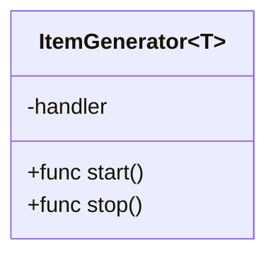
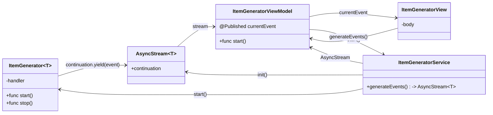
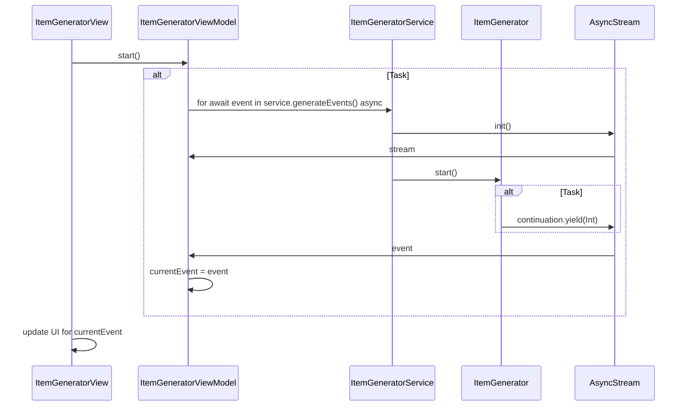
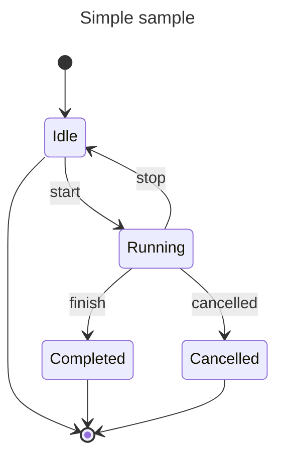
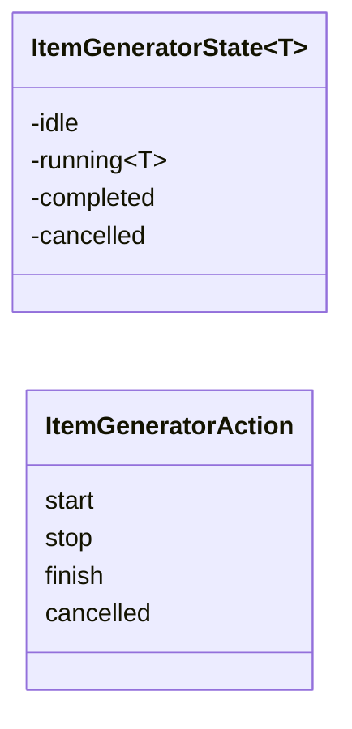
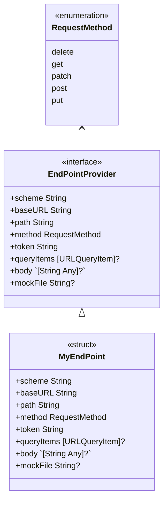
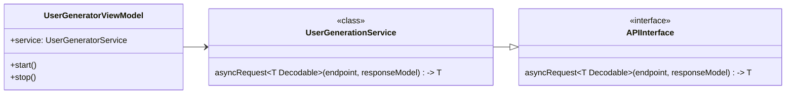

#  Continutation Capture
The `AsyncStream` init is usually passed a `continuation` object:


## Objects

|Name|Notes|
|-|-|
|ItemGenerator<T>|Generates Events.  Its handler captures the continuation|
|ItemGeneratorService|Provides access to events generated by the `ItemGenerator<T>`.  Events are accessed via an `AsyncStream`|
|ItemGeneratorViewModel|Uses the service to access events and updates its `@Published` field when the latest event is generated by the stream.|
|ItemGeneratorView|Displays the UI to start, stop and display the latest event.|

### `ItemGenerator<T>`
|ItemGenerator<T>|
|-|
|**State**|
|private let handler: ((T) -> Void)?|
|**Functionality**|
|init(_ handler: ((T) -> Void)? = nil)
|func start()|
|func stop()|

The `handler` field is used to store the closure that is executed esch time an event is generated by the ItemGenerator<T>.  Initially this field is set to `nil`.

```swift
class ItemGenerator<T> {
    private var handler: ((T) -> Void)?
    
    init(_ handler: ((T) -> Void)? = nil) {
        self.handler = handler
    }
    
    func start() {
        for i in 0..<10 {
            guard let ha = handler else { return }
            ha(i as! T)
        }
    }
    
    func stop() {
        self.handler = nil
    }
}
```



To create the object, pass in a closure:
```swift
    func generateEvents() -> AsyncStream<Int> {
        return AsyncStream<Int> { continuation in
            let generator = ItemGenerator<Int> { event in
                continuation.yield(event)
            }
            
            generator.start()
        }
    }
```

### `ItemGeneratorViewModel`
After a few changes to the `ItemGeneratorViewModel` we have:
```swift
class ItemGeneratorViewModel: ObservableObject {
    @Published var currentEvent: Int = -1
    private let service: ItemGeneratorService? = ItemGeneratorService()
    
    func start() {
        Task {
            guard let srv = service else { return }
            
            // start the event generation by calling the service
            for await event in srv.generateEvents() {
                currentEvent = event
            }
        }
    }
    
    func stop() {
        // stop the event generation by calling the service
        guard let srv = service else { return }
        srv.stopEventGeneration()
    }
}
```
If we run with this version of `ItemGeneratorViewModel`, we will see the following in the console highlighted in purple (which indicates a threading issue).
> Publishing changes from background threads is not allowed; make sure to publish values from the main thread (via operators like receive(on:)) on model updates.

to fix the issue, we can add the `@MainActor` attribute to the `ItemGeneratorViewModel`.  This will ensure that all functions contained within `ItemGeneratorViewModel` will run on the main thread.

### Class Diagram


### Sequence Diagram


Complete Code so far...

```swift
import Foundation
import SwiftUI

struct ItemGeneratorView : View {
    @StateObject var viewModel: ItemGeneratorViewModel = ItemGeneratorViewModel()
    
    var body: some View {
        VStack {
            HStack {
                Button("Start") {
                    viewModel.start()
                }
                Button("Stop") {
                    viewModel.stop()
                }
            }
            Text("\(viewModel.currentEvent)")
        }
    }
}

@MainActor
class ItemGeneratorViewModel: ObservableObject {
    @Published var currentEvent: Int = -1
    private let service: ItemGeneratorService? = ItemGeneratorService()
    
    func start() {
        Task {
            guard let srv = service else { return }
            
            // start the event generation by calling the service
            for await event in srv.generateEvents() {
                do {
                    currentEvent = event
                } 
            }
        }
    }
    
    func stop() {
        // stop the event generation by calling the service
        guard let srv = service else { return }
        srv.stopEventGeneration()
    }
}

class ItemGeneratorService {
    private var generator: ItemGenerator<Int>! = nil
    
    func generateEvents() -> AsyncStream<Int> {
        AsyncStream<Int> { continuation in
            self.generator = ItemGenerator<Int> { event in
                try? await Task.sleep(for: .milliseconds(2000))
                continuation.yield(event)
            }
            
            generator.start()
        }
    }
    
    func stopEventGeneration() {
        generator = nil
    }
}

class ItemGenerator<T> {
    private var handler: ((T) async -> Void)?
    
    init(_ handler: ((T) async -> Void)? = nil) {
        self.handler = handler
    }
    
    func start() {
        Task {
            for i in 0..<10 {
                guard let ha = handler else { return }
                await ha(i as! T)
            }
        }
    }
    
    func stop() {
        self.handler = nil
    }
}
```

### State Machine
It would be nice to display the status of the stream, the status could be:

|State|
|-|
|Idle|
|Running|
|Completed|
|Cancelled|

The transition between states (the edges) are:

|Action|
|-|
|start|
|stop|
|finish|
|cancelled|

The state transitions are

|State|Action|New State|
|-|-|-|
|Idle|start|Running|
|Running|stop|Idle|
|Running|finish|Completed|
|Running|cancelled|Cancelled|
|Completed|`*`|
|Cancelled|`*`|


The following state machine describes the states and their transitions:




An initial take at objects to model state:

```swift
enum ItemGeneratorState<T> {
    case idle
    case running(T)
    case completed
    case cancelled
}

enum ItemGeneratorAction {
    case start
    case stop
    case finish
    case cancelled
}
```

### Cancellation
To cancel a stream, we need to do the following:
- Set the `onTermination` on the continutation
- Call the `task.cancel()` on the saved task
- Set the saved task to nil

To make things a bit simpler when cancelling tasks, we can provide a protocol that provides a `cancelTask()` function:

```swift
protocol TaskCancellable : AnyObject {
    var task: Task<(), Never>? { get set }
    func cancelTask()
}

extension TaskCancellable {
    func cancelTask() {
        guard let t = self.task else { return }
        t.cancel()
        self.task = nil
    }
}
```
> We conform the protocol to `AnyObject` to ensure that only class objects can adopt the protocol

To use `TaskCancellable`:

```swift
@MainActor
class ItemGeneratorViewModel: ObservableObject, @preconcurrency TaskCancellable {
...    
    func stop() {
        // cancel and set task to nil
        cancelTask()
        
        guard let srv = service else { return }
        srv.stopEventGeneration()
    }
}
```
> The `@preconcurrency` attribute is used to silence Swift 6 errors

After adding a few print statements to the code, we have the following output

```
ItemGeneratorViewModel.start() called
ItemGeneratorViewModel.task initialized
ItemGeneratorViewModel.start() ended
ItemGeneratorViewModel.task started
ItemGeneratorService.task initialized
ItemGeneratorService.task started
event: 0
event: 1
event: 2
event: 3
event: 4
event: 5
event: 6
event: 7
event: 8
event: 9
ItemGeneratorService.task ended
ItemGeneratorViewModel.stop() called
ItemGeneratorViewModel.task cancelled
ItemGeneratorViewModel.task deinitialized
ItemGeneratorService.task cancelled
ItemGeneratorService.task deinitialized
ItemGeneratorViewModel.stop() ended
ItemGeneratorViewModel.task ended
```

## Networking
To access a remote resource and return the results of a web service request, we can use the `async` version of `URLSession.shared.data(from:)` and `await` on the results.  Then use `JSONDecoder().decode()` to create an array of `JSONPlaceholderUser`.  Then iterate over the array and add each array element to the `AsyncStream<JSONPlaceholderUser>` that is returned from the `start()`.

```swift
class UserGeneratorService {
    let url: String = "https://jsonplaceholder.typicode.com/users"
    
    // Returns a stream of JSONPlaceholderUser
    func start() -> AsyncStream<JSONPlaceholderUser> {
        return AsyncStream<JSONPlaceholderUser> { continuation in
            Task {
                // Get and serialize the JSON Users
                let url = URL(string: url)!

                /// Use URLSession to fetch the data asynchronously.
                let (data, response) = try await URLSession.shared.data(from: url)
                
                /// Decode the JSON response into the PostResponse struct.
                let jsonUsers: [JSONPlaceholderUser] = try JSONDecoder().decode([JSONPlaceholderUser].self, from: data)
                
                for jsonUser in jsonUsers {
                    try? await Task.sleep(for: .milliseconds(2000))
                    continuation.yield(jsonUser)
                }
            }
        }
    }
}
```
We can create a protocol that defines a consistent way to make an async call

```swift
protocol APIInterface {
    func asyncRequest<T: Decodable>(endpoint: EndpointProvider, responseModel: T.Type) async throws -> T
}
```

The endpoint and request type are defined as:
```swift
enum RequestMethod: String {
    case delete = "DELETE"
    case get = "GET"
    case patch = "PATCH"
    case post = "POST"
    case put = "PUT"
}

protocol EndpointProvider {
    var scheme: String { get }
    var baseURL: String { get }
    var path: String { get }
    var method: RequestMethod { get }
    var token: String { get }
    var queryItems: [URLQueryItem]? { get }
    var body: [String: Any]? { get }
    var mockFile: String? { get }
}
```
We can implement the protocol with a concrete type:
```swift
struct MyEndpoint: EndpointProvider {
    var scheme: String
    var baseURL: String
    var path: String
    var method: RequestMethod
    var token: String
    var queryItems: [URLQueryItem]?
    var body: [String : Any]?
    var mockFile: String?
    
    init(_ url: String) {
        scheme = ""
        baseURL = url
        path = ""
        method = .get
        token = ""
        queryItems = nil
        body = nil
        mockFile = nil
    }
}
```



Have the `UserGenerationService` adopt the `APIInterface` protocol

```swift
class UserGeneratorService {
    let url: String = "https://jsonplaceholder.typicode.com/users"
    
    // Returns a stream of JSONPlaceholderUser
    func start() -> AsyncStream<JSONPlaceholderUser> {
        return AsyncStream<JSONPlaceholderUser> { continuation in
            Task {
                let endpoint: EndpointProvider = MyEndpoint(url)
                
                do {
                    let jsonUsers = try await asyncRequest(endpoint: endpoint, responseModel: [JSONPlaceholderUser].self)
                    for jsonUser in jsonUsers {
                        try? await Task.sleep(for: .milliseconds(2000))
                        continuation.yield(jsonUser)
                    }
                } catch {
                    continuation.finish()
                }
            }
        }
    }
    
    func stop() async {
        
    }
}

extension UserGeneratorService : APIInterface {
    func asyncRequest<T>(endpoint: any EndpointProvider, responseModel: T.Type) async throws -> T where T : Decodable {
        // Get and serialize the JSON Users
        let url = URL(string: url)!

        /// Use URLSession to fetch the data asynchronously.
        let (data, response) = try await URLSession.shared.data(from: url)
        
        /// Decode the JSON response into the PostResponse struct.
        let jsonUsers: [JSONPlaceholderUser] = try JSONDecoder().decode([JSONPlaceholderUser].self, from: data)
        
        return jsonUsers as! T
    }
}
```

The view model will call the `asyncRequest<T>()` function:

```swift
@MainActor
class UserGeneratorViewModel : ObservableObject {
    let service: UserGeneratorService = UserGeneratorService()
    @Published var currentUser: JSONPlaceholderUser?
    @Published var users: [JSONPlaceholderUser] = []
    
    func start() {
        Task {
            for await jsonUser in service.start() {
                currentUser = jsonUser
                users.append(jsonUser)
            }
        }
    }
    
    func stop() {
        
    }
}
```

> Contextual closure type '@Sendable () async -> JSONPlaceholderUser?' expects 0 arguments, but 1 was used in closure body

```swift
func start() -> AsyncStream<JSONPlaceholderUser> {
        return AsyncStream<JSONPlaceholderUser> { continuation in
            self.continuation = continuation
            continuation.onTermination { _ in
                stop()
            }
            
            Task {
                let endpoint: EndpointProvider = MyEndpoint(url)
                
                do {
                    let jsonUsers = try await asyncRequest(endpoint: endpoint, responseModel: [JSONPlaceholderUser].self)
                    for jsonUser in jsonUsers {
                        try? await Task.sleep(for: .milliseconds(2000))
                        continuation.yield(jsonUser)
                    }
                } catch {
                    continuation.finish()
                }
            }
        }
    }
```

## Task Groups

```swift
func loadUpdates() async -> AsyncStream<Double> {
    let calls: [Call] = [.first, .second, .third]

    let progress = Progress()

    return AsyncStream { continuation in
        let task = Task {
            await withTaskGroup(of: Void.self) { group in
                for call in calls {
                    progress.totalUnitCount += 1
                    group.addTask { [self, progress] in
                        await testFunc(call)
                        progress.completedUnitCount += 1
                        continuation.yield(progress.fractionCompleted)
                    }
                }
                await group.waitForAll()
                continuation.finish()
            }
        }

        continuation.onTermination = { _ in
            task.cancel()
        }
    }
}
```

